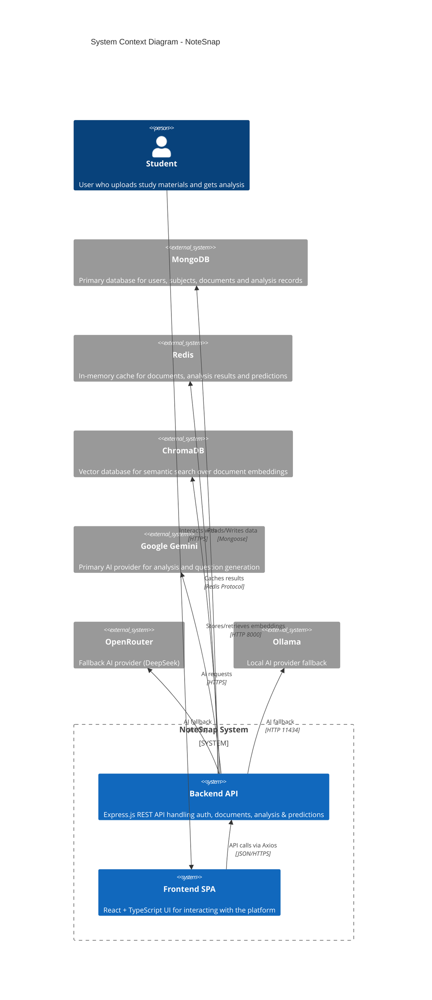
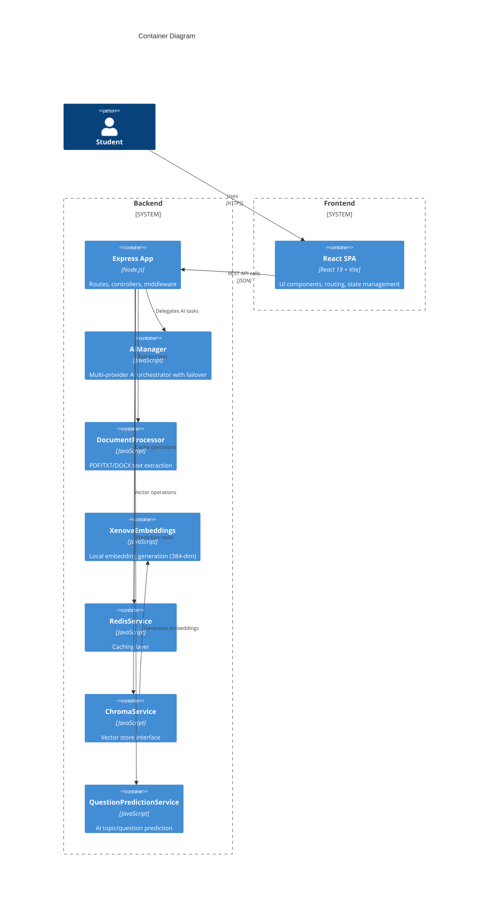
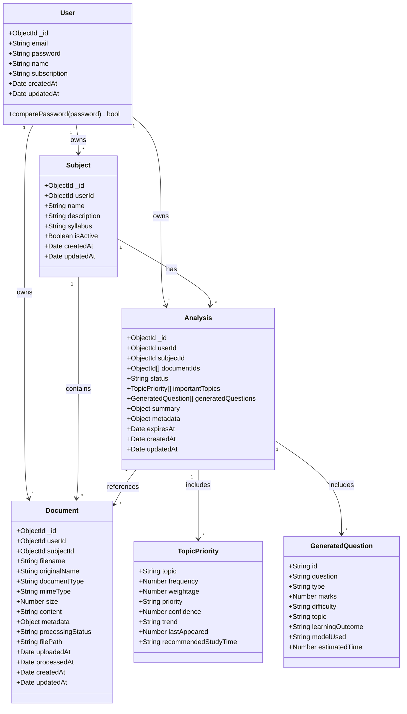
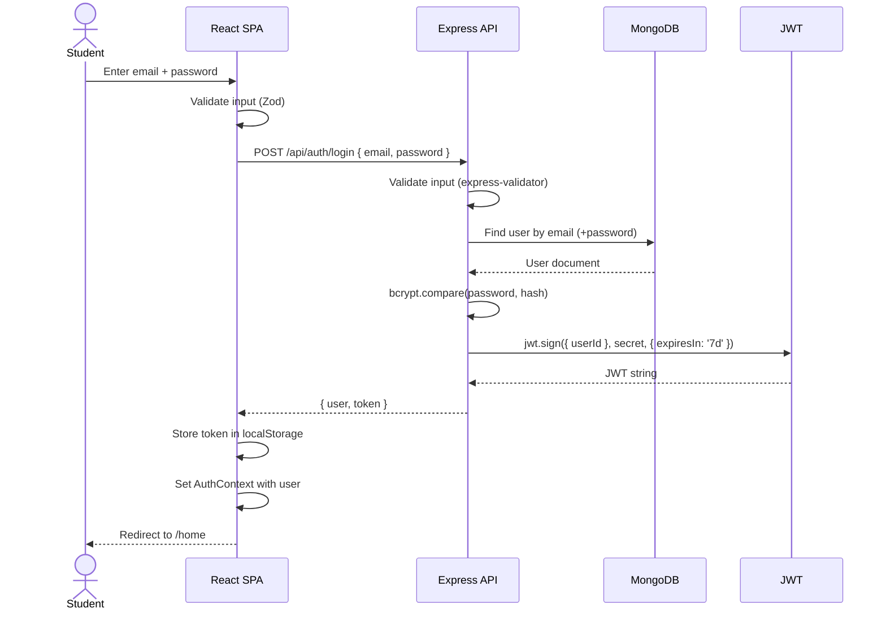
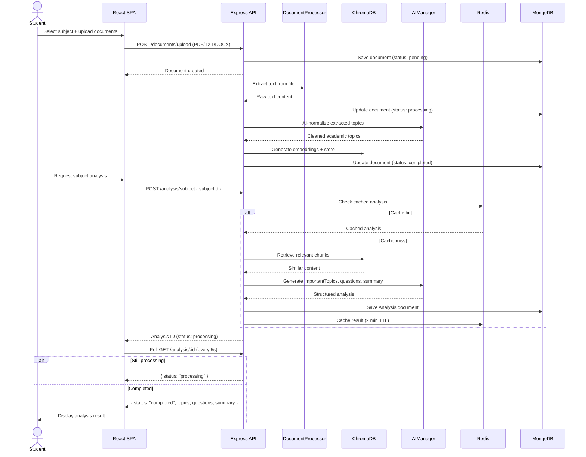
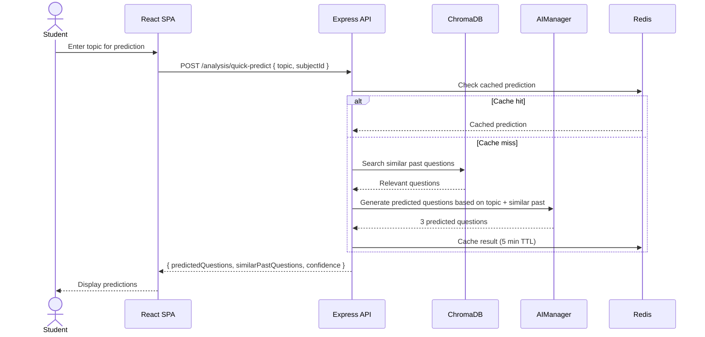
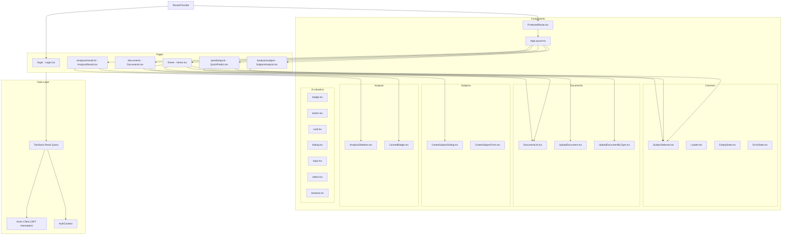
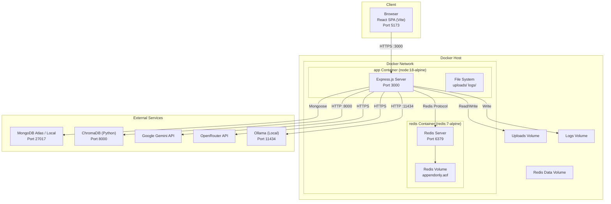

# NoteSnap - AI-Powered Study Note Summarizer

> AI-driven exam preparation assistant that analyzes study materials, predicts important topics, and generates practice questions.

NoteSnap helps students upload their study materials (syllabus, notes, previous year questions, textbooks), analyzes them using multi-provider AI (Gemini, Ollama, OpenRouter), extracts important topics with priority scoring, generates predictive exam questions, and produces study summaries with recommendations.

---

## Features

- **Multi-Provider AI Orchestration** — Automatic failover across Google Gemini, Ollama (local), and OpenRouter (DeepSeek)
- **Document Management** — Upload PDF, TXT, or DOCX files categorized as syllabus, notes, PYQ, or textbook
- **Vector Search (RAG)** — Local embeddings via Xenova all-MiniLM-L6-v2 stored in ChromaDB for semantic retrieval
- **Subject Analysis** — Extracts 6–10 important topics with frequency, weightage, trend, and priority scoring
- **Question Prediction** — AI generates 8–12 practice questions with type, marks, difficulty, and estimated time
- **Quick Predict** — Topic-based exam question prediction using ChromaDB similarity search
- **Redis Caching** — Cached analysis results, document status, and predictions with 2–10 minute TTLs
- **Dockerized** — Multi-stage Dockerfile + docker-compose with Redis
- **Security** — JWT auth, bcrypt hashing, rate limiting, Helmet headers, input validation

---

## Tech Stack

| Layer | Technology |
|-------|-----------|
| **Runtime** | Node.js 18+, Docker (node:18-alpine) |
| **Backend** | Express.js 5, Mongoose 9 (MongoDB ODM) |
| **Database** | MongoDB + ChromaDB (vector store) |
| **Caching** | Redis 7 |
| **AI Providers** | Google Gemini, Ollama, OpenRouter (DeepSeek) |
| **Embeddings** | Xenova Transformers (all-MiniLM-L6-v2, 384-dim) |
| **File Processing** | PDF.js, Multer |
| **Frontend** | React 19, TypeScript, Vite 7 |
| **Routing** | React Router DOM 7 |
| **State/Data** | TanStack React Query 5 |
| **Styling** | Tailwind CSS 3, shadcn/ui (Radix primitives) |
| **Auth** | JWT (7-day expiry), bcryptjs (12 rounds) |
| **Logging** | Winston + Morgan |
| **Security** | Helmet, CORS, express-rate-limit |
| **DevOps** | Docker, docker-compose |

---

## System Architecture





---

## UML Class Diagrams

### Domain Model — MongoDB Schemas



### AI Provider Class Hierarchy (Strategy Pattern)

```mermaid
classDiagram
  class BaseProvider {
    <<abstract>>
    +String name
    +generate(prompt) Promise~String~*
  }

  class GeminiProvider {
    +String name
    +generate(prompt) Promise~String~
  }

  class OllamaProvider {
    +String name
    +generate(prompt) Promise~String~
  }

  class OpenRouterProvider {
    +String name
    +generate(prompt) Promise~String~
  }

  class AIManager {
    -BaseProvider[] providers
    +generate(prompt) Promise~{output, provider}~
  }

  BaseProvider <|-- GeminiProvider
  BaseProvider <|-- OllamaProvider
  BaseProvider <|-- OpenRouterProvider
  AIManager o--> BaseProvider : delegates to
```

---

## System Sequence Diagrams

### Authentication Flow (Login)



### Subject Analysis Flow



### Quick Predict Flow



---

## Frontend Component Hierarchy



---

## Deployment Architecture



---

## Directory Structure

```
noteSnap/
├── backend/
│   ├── src/
│   │   ├── app.js                    # Express entry point
│   │   ├── config/
│   │   │   ├── database.js           # Mongoose connection
│   │   │   └── env.js               # Environment validation
│   │   ├── models/
│   │   │   ├── User.js
│   │   │   ├── Subject.js
│   │   │   ├── Document.js
│   │   │   └── Analysis.js
│   │   ├── routes/
│   │   │   ├── auth.js
│   │   │   ├── subjects.js
│   │   │   ├── documents.js
│   │   │   └── analysis.js
│   │   ├── controllers/
│   │   │   ├── authController.js
│   │   │   ├── subjectController.js
│   │   │   ├── documentController.js
│   │   │   └── analysisController.js
│   │   ├── middleware/
│   │   │   ├── auth.js               # JWT verification
│   │   │   ├── upload.js             # Multer config
│   │   │   ├── validation.js         # express-validator rules
│   │   │   └── errorHandler.js       # Global error handler
│   │   ├── services/
│   │   │   ├── ChromaService.js      # ChromaDB interface
│   │   │   ├── DocumentProcessor.js  # PDF/TXT/DOCX extraction
│   │   │   ├── XenovaEmbeddings.js   # Local embeddings
│   │   │   ├── RedisService.js       # Caching layer
│   │   │   ├── QuestionPredictionService.js
│   │   │   ├── AnalysisService.js
│   │   │   └── OllamaService.js
│   │   ├── ai/
│   │   │   ├── AIManager.js          # Multi-provider orchestrator
│   │   │   ├── index.js             # Provider factory
│   │   │   └── providers/
│   │   │       ├── BaseProvider.js
│   │   │       ├── GeminiProvider.js
│   │   │       ├── OllamaProvider.js
│   │   │       └── OpenRouterProvider.js
│   │   └── utils/
│   │       ├── ApiError.js
│   │       ├── ApiResponse.js
│   │       ├── asyncHandler.js
│   │       ├── constants.js
│   │       ├── logger.js
│   │       └── normalizeGeneratedQuestions.js
│   ├── uploads/
│   ├── logs/
│   ├── Dockerfile
│   ├── docker-compose.yml
│   └── package.json
│
├── frontend/
│   ├── src/
│   │   ├── main.tsx                  # Entry point
│   │   ├── app/
│   │   │   ├── App.tsx              # Root component
│   │   │   └── router.tsx           # Route definitions
│   │   ├── auth/
│   │   │   ├── auth.api.ts
│   │   │   ├── AuthContext.tsx
│   │   │   └── useAuthActions.ts
│   │   ├── api/
│   │   │   ├── client.ts            # Axios instance + JWT interceptor
│   │   │   ├── subject.api.ts
│   │   │   ├── document.api.ts
│   │   │   ├── analysis.api.ts
│   │   │   ├── quickPredict.api.ts
│   │   │   └── predict.api.ts
│   │   ├── hooks/
│   │   │   ├── useSubjects.ts
│   │   │   ├── useCreateSubject.ts
│   │   │   ├── useDocuments.ts
│   │   │   ├── useUploadDocument.ts
│   │   │   ├── useUploadDocumentByType.ts
│   │   │   ├── useDeleteDocument.ts
│   │   │   ├── useStartAnalysis.ts
│   │   │   ├── useAnalysisResult.ts
│   │   │   └── useQuickPredict.ts
│   │   ├── components/
│   │   │   ├── layout/AppLayout.tsx
│   │   │   ├── common/ (SubjectSelector, Loader, EmptyState, ErrorState)
│   │   │   ├── subjects/ (CreateSubjectDialog, CreateSubjectForm)
│   │   │   ├── documents/ (DocumentList, UploadDocument, UploadDocumentByType)
│   │   │   ├── analysis/ (AnalysisSkeleton, CachedBadge)
│   │   │   └── ui/ (shadcn primitives)
│   │   ├── pages/
│   │   │   ├── Login.tsx
│   │   │   ├── Home.tsx
│   │   │   ├── Documents.tsx
│   │   │   ├── SubjectAnalysis.tsx
│   │   │   ├── AnalysisResult.tsx
│   │   │   └── QuickPredict.tsx
│   │   ├── types/
│   │   ├── schemas/
│   │   └── lib/
│   ├── vite.config.ts
│   ├── tailwind.config.js
│   └── package.json
│
└── python-services/
    └── chroma/                       # ChromaDB persistent data
```

---

## API Reference

### Health
| Method | Endpoint | Auth | Description |
|--------|----------|------|-------------|
| GET | `/health` | No | Server health check |

### Auth
| Method | Endpoint | Auth | Description |
|--------|----------|------|-------------|
| POST | `/api/auth/register` | No | Register new user |
| POST | `/api/auth/login` | No | Login |
| GET | `/api/auth/profile` | Yes | Current user profile |

### Subjects
| Method | Endpoint | Auth | Description |
|--------|----------|------|-------------|
| POST | `/api/subjects` | Yes | Create subject |
| GET | `/api/subjects` | Yes | List subjects |
| GET | `/api/subjects/:id` | Yes | Get subject with stats |
| PUT | `/api/subjects/:id` | Yes | Update subject |
| DELETE | `/api/subjects/:id` | Yes | Soft-delete subject |

### Documents
| Method | Endpoint | Auth | Description |
|--------|----------|------|-------------|
| GET | `/api/documents` | Yes | List (query: subjectId) |
| POST | `/api/documents/upload` | Yes | Generic upload |
| POST | `/api/documents/upload/:type` | Yes | Typed upload (syllabus\|notes\|pyq\|textbook) |
| GET | `/api/documents/single/:id` | Yes | Get document |
| GET | `/api/documents/:id/status` | Yes | Processing status |
| DELETE | `/api/documents/:id` | Yes | Delete document |
| GET | `/api/documents/stats/document-stats` | Yes | Document statistics |
| GET | `/api/documents/stats/vector` | Yes | Vector store stats |

### Analysis
| Method | Endpoint | Auth | Description |
|--------|----------|------|-------------|
| POST | `/api/analysis/subject` | Yes | Start subject analysis |
| GET | `/api/analysis` | Yes | List analyses (query: subjectId) |
| GET | `/api/analysis/:id` | Yes | Get analysis result |
| POST | `/api/analysis/generate-questions` | Yes | Generate practice questions |
| POST | `/api/analysis/quick-predict` | Yes | Quick topic-based prediction |

---

## Setup & Running

### Prerequisites
- Node.js 18+
- MongoDB (local or Atlas)
- Redis 7+
- Python 3.9+ with ChromaDB (for vector search)
- (Optional) ChromaDB server running on port 8000

### Backend Setup

```bash
cd backend
cp .env.example .env   # Configure your environment variables
npm install
npm run dev            # Starts with nodemon on port 3000
```

### Frontend Setup

```bash
cd frontend
npm install
npm run dev            # Starts Vite dev server on port 5173
```

### Docker Deployment

```bash
cd backend
docker-compose up -d   # Builds and starts app + redis
# App on :3000, Redis on :6379
```

### Environment Variables

| Variable | Required | Description |
|----------|----------|-------------|
| `MONGODB_URI` | Yes | MongoDB connection string |
| `JWT_SECRET` | Yes | JWT signing secret |
| `GEMINI_API_KEY` | Yes | Google Gemini API key |
| `PORT` | No | Server port (default: 3000) |
| `REDIS_URL` | No | Redis connection (default: redis://localhost:6379) |
| `AI_PROVIDER_ORDER` | No | Comma-separated provider priority (default: gemini,openrouter,ollama) |
| `OPENROUTER_API_KEY` | No | OpenRouter API key |
| `OLLAMA_BASE_URL` | No | Ollama server URL (default: http://localhost:11434) |
| `NODE_ENV` | No | Environment (development/production) |

---

## AI Provider Configuration

The system supports multiple AI providers with automatic failover. Configure via `AI_PROVIDER_ORDER`:

```
# Try Gemini first, fallback to OpenRouter, then Ollama
AI_PROVIDER_ORDER=gemini,openrouter,ollama
```

Each provider requires its own API credentials:
- **Gemini** — `GEMINI_API_KEY` from [Google AI Studio](https://aistudio.google.com/)
- **OpenRouter** — `OPENROUTER_API_KEY` from [OpenRouter](https://openrouter.ai/)
- **Ollama** — Local installation with model served on `OLLAMA_BASE_URL`

---

## Testing

```bash
cd backend
npm test              # Jest test suite
```
